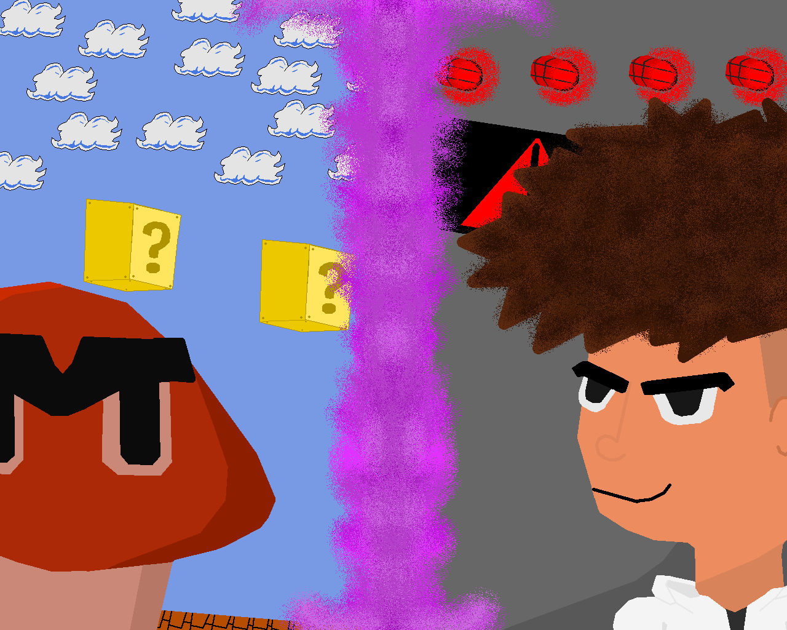
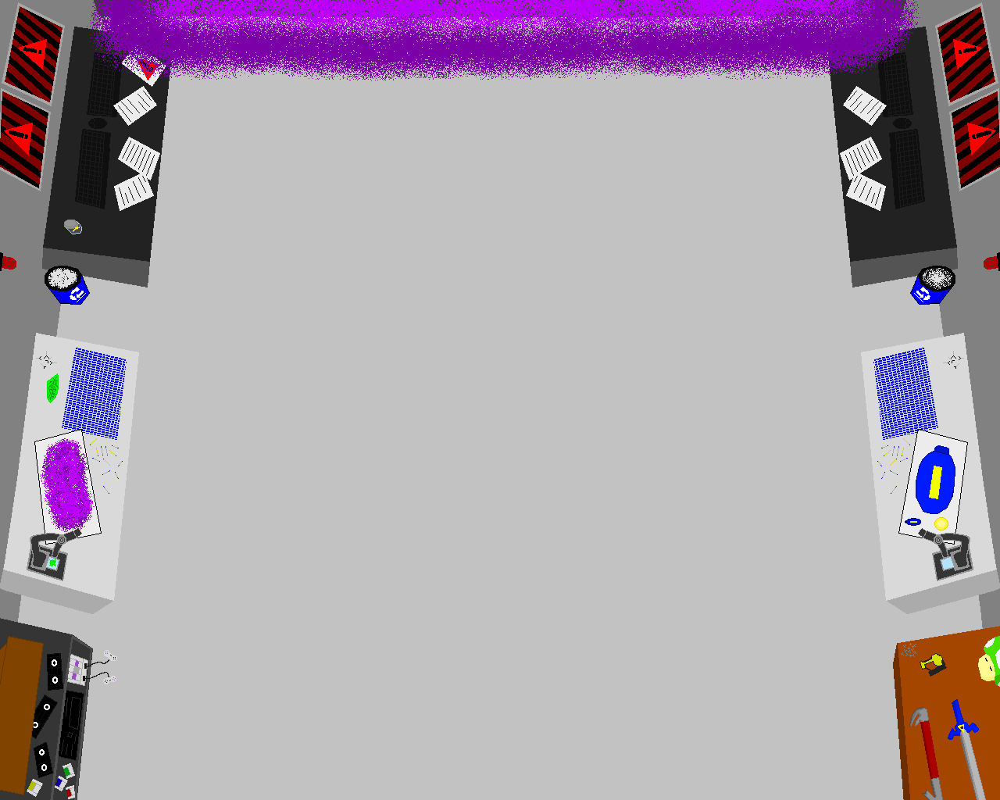

<h1 align="center">RetroRift: Legends</h1>

An award-winning 2D top-down shooter game made in the Unity platform, as a college project for Faculdade de Tecnologia de Americana.
 

This is the repository for the complete source codes and assets used in the game. You can use it for free to learn, research, modify or improve the game. The limit is your imagination!

 

<a href="https://leonardont.itch.io/retrorift-legends" target="_blank">Check this game at itch.io here!</a>

 

 

<h3 align="center">RetroRift: Legends has won the Huizinga Award at Faculdade de Tecnologia de Americana in September 21st, 2022.</h3> 

The Huizinga Award is a highly esteemed college award that recognizes outstanding achievement in the field of digital game development. Presented each semester at Faculdade de Tecnologia de Americana to the top student game project, this award celebrates creativity, innovation, and technical skill in the design and development of digital games.
 

Named after the renowned Dutch historian and philosopher Johan Huizinga, the Huizinga Award reflects his belief that play and games are integral to human culture and expression. Just as Huizinga saw games as an essential part of human experience, this award recognizes the essential role that digital games play in contemporary society, both as entertainment and as a means of artistic expression.
 

Winning the Huizinga Award is a great honor, not only for the student developer or development team, but also for Faculdade de Tecnologia de Americana as a whole. It represents the highest level of excellence in digital game development, and serves as a testament to the dedication and hard work of the award recipient.
 

Whether you are a game developer, a student, or simply a fan of digital games, the Huizinga Award is a symbol of excellence and achievement in the field of game development, and a source of inspiration and motivation for all who aspire to create great games.

 

 

<h3 align="center">Welcome to 2050, fellow scientist!</h3>
 
<h4 align="center">You are in charge of creating the virtuality portal, which can bring together the digital and real world in many ways.</h4>
<h4 align="center">Will this be a good feature... or the actual extinction of our race?</h4>

 

 

Control your character with the <b>W, A, S and D</b> keys or the arrow keys.

Press the <b>Spacebar</b> to shoot.

You must hit the enemies, commonly seen as the <b>"bad guys"</b> in retro games, and carefully dodge the obstacles, known as the <b>"good guys"</b>.

 

<b>Are you up to the challenge?</b>

 
 
 

 

<h3 align="center"><b>Credits</b></h3>

 

<h3 align="center"><i><b>Music</b></i></h3>

"This Is Our Only Chance" by Cody O'Quinn

"We're Doing This The Hard Way" by Cody O'Quinn

"We Can't Slow Down Now" by Cody O'Quinn

"Star Striker" by Cody O'Quinn

 

<h3 align="center"><i><b>Artwork</b></i></h3>

<b>Drawn entirely by</b>

Leonardo Nabarro Tonezer

<b>Inspiration</b>

SUPER MARIO BROS.© (Nintendo Co., Ltd - All Rights Reserved)

Sonic the Hedgehog© (Sega Corporation - All Rights Reserved)

Goomba© (Nintendo Co., Ltd - All Rights Reserved)

Knight© (Nintendo Co., Ltd - All Rights Reserved)

Motobug© (Sega Corporation - All Rights Reserved)

Mega Man© and Mega Man© Blaster© (Capcom Co., Ltd - All Rights Reserved)

 

<h3 align="center"><i><b>Project</b></i></h3>

<b>Project Director, Unity Developer, C# Scripts Developer, Animation Developer, Digital Artist, Storyboard Creator</b>

Leonardo Nabarro Tonezer

<b>Unity Developer, C# Scripts Developer</b>

Mileny Fernanda de Souza Clemente

 

 

<h4 align="center">DISCLAIMER: "RetroRift: Legends" is a personal project, developed for the "Programming II" subject, coded "ILP201", at Faculdade de Tecnologia de Americana (FATEC-AM), located in Americana, São Paulo, Brazil.<h4>
<h4 align="center">This project does NOT comercially profit today, has NOT comercially profited in the past, and will NOT comercially profit in the future.</h4>
<h4 align="center">The owners and participants of this project do not sell, endorse the selling or receive any money for the copies of this project, strictly because there is copyrighted material from third parties developed into it.</h4>
 
<h4 align="center">THE HEREBY PROJECT SHALL BE USED ONLY AND EXCLUSIVELY FOR RESEARCH PURPOSES.</h4>

 

 

<h3 align="center">Copyright © 2022 Leonardo Nabarro Tonezer & Mileny Fernanda de Souza Clemente</h3>
<h3 align="center">Apache License - Version 2.0</h3>
